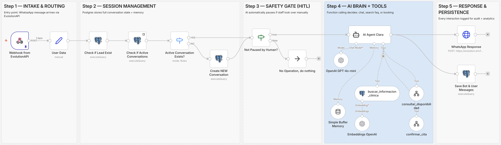

# AI Appointment Setter: 24/7 Dental Clinic Receptionist 🦷

> **The Problem**: 60% of dental leads go cold within 5 minutes. This AI Agent responds in <10 seconds, qualifies patients, and books appointments autonomously via WhatsApp—converting "Lead Zombies" into confirmed revenue.


## 💡 Use Case: Typical Dental Clinic Scenario

**Clinic Profile:**
- 3 dentists, 1 receptionist
- ~80 WhatsApp inquiries/month
- Open Mon-Fri 9AM-6PM, Sat 9AM-2PM

**Current Pain Points:**
- 40% of leads arrive outside business hours → lost revenue
- Receptionist spends 12+ hours/week answering repetitive FAQs
- Follow-ups for "I'll think about it" leads never happen

**How This AI Agent Helps:**

| Task | Manual (Before) | Automated (After) |
|------|----------------|-------------------|
| Respond to inquiry | 2-4 hours | <10 seconds |
| Check calendar availability | 3-5 back-and-forth messages | 1 AI tool call |
| Book appointment | 5+ minutes per booking | 30 seconds automated |
| Answer FAQ (prices, insurance) | Receptionist interruption | Instant RAG retrieval |
| Follow up with warm leads | Rarely done | Automated reminders (roadmap) |

**Conservative Estimate:**
- If this captures just 20% of after-hours leads → ~16 extra appointments/month
- At $100 average treatment value → $1,600 additional monthly revenue
- Receptionist time freed: ~10 hours/week for higher-value tasks


**Current Status:** System fully operational, seeking pilot clinic to validate real-world metrics.

---

## 🎯 What It Does (The "So What?")

**Before**: Patient messages clinic → waits hours → forgets → books elsewhere  
**After**: AI qualifies pain/urgency → checks real calendar → books appointment → syncs to Google Calendar

### Live Demo
| Conversation 1/2 | Conversation 2/2 | GCal Appointment |
| :---: | :---: | :---: |
|  |  |  |

---

## 🏗️ Architecture Highlights (The "How?")

### 1. Intelligent Session Management
```
┌─ New lead? → Create conversation + memory
├─ Returning lead? → Resume from last state  
└─ Human intervened? → AI automatically pauses
```
- **Tech**: PostgreSQL + PostgresChatMemory
- **Why it matters**: Zero context loss, even across days

### 2. Human-in-the-Loop Safety Gate
```python
if lead.paused_by_human:
    return None  # AI steps back, no overlap
```
- **Why it matters**: Staff can take over anytime, AI knows when to stop

### 3. Real-Time Tool Use (Function Calling)
The AI doesn't just chat—it *acts*:
- `consultar_disponibilidad` → Queries Google Calendar API
- `confirmar_cita` → Books appointment + sends confirmation
- `buscar_informacion_clinica` → RAG over clinic FAQ (Postgres pgvector)

**Model**: ChatGPT 4.1 mini (chosen for speed + tool use reliability)

### 4. Smart Scheduling Logic
- Parses natural language: "mañana por la tarde" → 15:00-19:00 range
- Respects business rules: No bookings on Sundays, 30-min slots only
- Conflict detection: Won't double-book existing appointments

---

## 🛠️ Technical Stack

| Layer | Technology | Why This Choice |
|-------|-----------|-----------------|
| **Orchestration** | n8n | Rapid prototyping + visual debugging |
| **AI Brain** | ChatGPT 4.1 mini | Excellent speed/cost for function calling |
| **Memory** | PostgreSQL + pgvector | Structured data + semantic search |
| **WhatsApp Bridge** | EvolutionAPI | Official API support + webhooks |
| **Calendar** | Google Calendar API | Direct integration, no middleware |

---

## 🚀 Production Considerations

### Current Limitations (MVP Phase)
- Single-threaded conversation handling
- No A/B testing framework for prompt variations
- Limited analytics dashboard

### Migration Roadmap: Python-Core Architecture
```
n8n (Current) → FastAPI + LangGraph (Target)
```
**Why migrate?**
- Complex branching logic (multi-condition routing)
- Horizontal scalability (handle 100+ concurrent chats)
- Advanced observability (LangSmith tracing)
- Easier CI/CD integration

**ETA**: When clinic scales beyond 500 leads/month

---

## 💡 Key Innovation: The "Lead Zombie" Killer

**Industry Problem**: 
- Average response time: 2-4 hours
- 60% of leads book elsewhere within 24 hours

**This Solution**:
- Response time: <10 seconds
- Qualification + booking in single conversation
- No lead goes unanswered (even at 2 AM)

---

## 📸 Workflow Deep Dive



**Key Flow Stages:**
1. **Webhook Reception** → EvolutionAPI receives WhatsApp message
2. **Lead Detection** → Check if phone exists in DB
3. **Context Loading** → Retrieve conversation history + memory
4. **Pause Check** → Verify human hasn't taken over
5. **AI Processing** → ChatGPT decides: chat, search FAQ, or check calendar
6. **Response Routing** → WhatsApp reply or calendar booking
7. **State Persistence** → Save updated conversation state

---

## 🎓 What I Learned Building This

1. **LLMs need guard rails**: The pause logic prevents AI from "talking over" humans
2. **Tool calling ≠ Magic**: Spent 40% of dev time on tool schemas and error handling
3. **Memory is harder than it looks**: Balancing context window vs. retrieval precision
4. **Production ≠ Prototype**: Added retry logic, rate limiting, and fallback responses

---

## 📬 Want to Discuss?
This system is production-ready for clinics handling 50-500 leads/month. For enterprise-scale deployments, I'm building the FastAPI version with advanced routing and analytics.

[LinkedIn](https://www.linkedin.com/in/eric-felguera/) | [Email](mailto:eric.felguera@gmail.com) | [Calendar Booking Tool (dogfooding my own AI 😄)]
